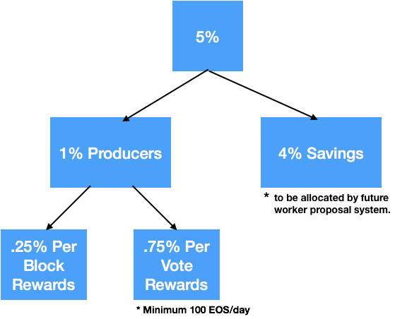
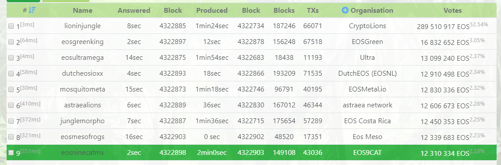
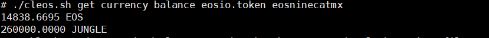
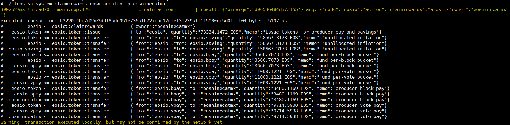
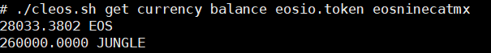

# Block Producer Rewards and Demo

- [Block Producer Rewards and Demo](#block-producer-rewards-and-demo)
  - [Block Producer Rewards](#block-producer-rewards)
  - [Demo - 'claim the reward'](#demo---claim-the-reward)
      - [Step1: let's start the `keosd` and unlock the wallet.](#step1-lets-start-the-keosd-and-unlock-the-wallet)
      - [Step2: Check the currency balance of our BP account.](#step2-check-the-currency-balance-of-our-bp-account)
      - [Step3: Claim the reward](#step3-claim-the-reward)
    - [Step4: Check the currency balance of our BP account again.](#step4-check-the-currency-balance-of-our-bp-account-again)
  - [Contact/About us](#contactabout-us)

## Block Producer Rewards

In the EOS ecosystem, Block Producers replace the concept of “miners” as the custodians of the network, running the underlying network layer to process all transactions.

There will be 21 active block producers and an estimated 100 standby block producers. According to the release of [Introducing EOSIO Dawn 4.0](https://medium.com/eosio/introducing-eosio-dawn-4-0-f738c552879) The top 21 active block producers will earn a 0.25% per block reward on a pro-rata basis to the number of blocks each one produces. All block producers (active + standby) will also earn a .75% per vote reward on a pro-rata basis to the total number of votes they receive.

Let's do a quick and simple math. 
Theoretically, in the EOS launch's first year - 

* 900M EOS (circulation) x 1% for the Block Producers = 9M EOS tokens
* Therefore approximately annually per block reward = 900M EOS x 0.25% = 2.25M EOS tokens, additionally annually per vote reward = 1 billion x 0.75% = 7.5M EOS tokens. In today's value, 1 EOS token is about 8.65USD (2018-07-05), the annual reward will be 86,500,000USD in total.

From the link [EOS Tracker - Producers](+https://eostracker.io/producers), we also could find that the top 54 block producers (vote rate more than 0.5%) are all able to earn and claim the reward. Running Block Producer is not cheap. The reward is how Blocker Producer will be paid for free transactions, infrastructure upgrades, community support, dAPPS, scaling the systems, labor cost and etc. At the same time, due to the demand for tokens from dAPP developers, the token price will go up. A good ecosystem makes everybody win.

## Demo - 'claim the reward'

Today, EOS9CAT team would like to show you how we claim the reward as a Block Producer.

Demo Environment:

- chain: [Jungle Test Net](http://jungle.cryptolions.io/#home)
- block producer: [eosninecatmx](http://jungle.cryptolions.io/#accountInfo:eosninecatmx)
- votes rate: 2.23% (12,310,334 EOS)

#### Step1: let's start the `keosd` and unlock the wallet.

#### Step2: Check the currency balance of our BP account.

`./cleos.sh get currency balance eosio.token eosninecatmx`

Now currently our balance is **14838.6695 EOS**.

#### Step3: Claim the reward

`./cleos.sh system claimrewards eosninecatmx -p eosninecatmx`

As we can see:

1. **"73334.1472 EOS"** - issue tokens for producer pay and savings
2. **"58667.3178 EOS"** - unallocated inflation (to eosio.saving)
3. **"3666.7073 EOS"** - fund per-block bucket (to eosio.bpay)
4. **"11000.1221 EOS"** - fund per-vote bucket (to eosio.vpay)

And then, here is our reward:

1. **"3480.1169 EOS"** - producer block pay (from eosio.bpay to eosninecatmx)
2. **"9714.5938 EOS"** - producer vote pay (from eosio.vpay to eosninecatmx)

Total: **13194.7107 EOS** = 114,134.25USD ($8.65USD)

### Step4: Check the currency balance of our BP account again.

`./cleos.sh get currency balance eosio.token eosninecatmx`

After the reward claim, the balance became **28033.3802 EOS**.
The diff between the those two balance was the reward we earned by producing the blocks and the votes.

The final reward which a BP could claim depends on a lot of assumptions and different situation. So far, the reward in the ecosystem is the one of the most important reasons why everyone is eager for a active Block Producer.

## Contact/About us
{{TODO}}