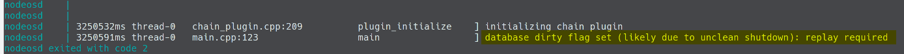
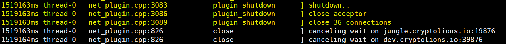
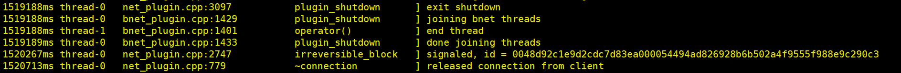

# EOS - `the database dirty flag set` why and how

## `nodeos` - the right way to start/stop

Most of the EOS node infrastructures in the community are built on top of docker. So do we. One of the most common and challenging error is `database dirty flag set` when the node instance shuts down. This leads to the node unable to restart properly from the previous point due to the broken data integrity.



Referring to our documentation of [How to build BP like a boss (Build Docker Image)](https://steemit.com/bitcoin/@eos9cat/how-to-build-bp-like-a-boss-build-bp-docker-image), we mentioned the reason that why that error happened and what was the best way to resolve the issue.

> **Caveat**
> 
> It's very important to make the `nodeos` command as the entry point. Otherwise, when the container is shutdown or stop, the `nodeos` won't get the `SIGNTERM` from the docker, and if the `nodeos` is NOT shut down gracefully, block database can NOT be used again and the node has to spend time to resync with the other nodes.
> 

Here is the demonstration of the shut-down process
In terms of the EOS source code, the `nodeos` will take the corresponding action, when it traps the `SIGNTERM` from the operation system.

* The `net_plugin` traps the **shutdown** signal and **close** the connections

* The `bnet_plugin` will also take the corresponding action to **end** the thread.


That's the only way to gracefully shutdown the `nodeos` and only after that, the database won't set the dirty flag and is able to be started again.

Launching the `nodeos` by running a `start.sh` in the `dockerfile` is a common way on the Internet now.

**start.sh**

`$NODEOSBINDIR/nodeos --data-dir $DATADIR --config-dir $DATADIR "$@" > $DATADIR/stdout.txt 2> $DATADIR/stderr.txt &  echo $! > $DATADIR/nodeos.pid`

**dockerfile**

```dockerfile
...
CMD ['./start.sh']
```

But this requires the human intervention (run `stop.sh`) to gracefully shutdown the `nodeos` before the docker container stops. By running `docker stop` or `docker restart` directly will consistently damage the data integrity and **set the database dirty flag**.

Below is the `dockerfile` we use to build our image, quoting from the [How to build BP like a boss (Build Docker Image)](https://steemit.com/bitcoin/@eos9cat/how-to-build-bp-like-a-boss-build-bp-docker-image)

```dockerfile
FROM ubuntu
RUN mkdir -p /opt/eos_node/data_dir \
    && cd /opt/eos_node
WORKDIR /opt/eos_node
COPY ./eos_source/ /opt/eos_node/eos_source/
EXPOSE 8888/tcp #http
EXPOSE 9876/tcp #p2p
EXPOSE 9875/tcp #bnet
VOLUME /opt/eos_node/data_dir
ENTRYPOINT ["/opt/eos_node/eos_source/build/programs/nodeos/nodeos", "--data-dir", "/opt/eos_node/data_dir", "--config-dir", "/opt/eos_node/data_dir", "--genesis-json", "/opt/eos_node/data_dir/genesis.json"]
```

## Snapshot Backup/Restore

With the blocks growing every seconds, the EOS node needs more and more time to re-sync or catch up with the other nodes from the 1st block on the net. Backing up the snapshot to be used when the incident happens becomes a critical challenge for each EOS node. 

Backing up a running node renders the database flagged invalid and defeats the purpose of a reusable backup. Knowing the root cause of the problem, now we are able to **start / stop** the EOS node with data integrity at any given time. This is the prerequisite for the clean **backup & restore**.

### Backup

After we **stop** the node peacefully, we run the command such as below to do the backup.

```sh
BACKUP_DATE_TIME=$(date +%Y%m%d_%H%M%S)
rsync -avhP --delete $SOURCE_DIRECTORY/ $DESTINATION_DIRECTORY --log-file=/var/log/rsync/backup_${BACKUP_DATE_TIME}.log
```

- `$SOURCE_DIRECTORY/` is the EOS `--data-dir` folder in the host mounted into the docker;
- `$DESTINATION_DIRECTORY` is the folder we save the backups;
- `BACKUP_DATE_TIME` is the backup data and time;

Once the backup is completed, we could easily **start-up** the node again.

### Restore

It's the same that let's **stop** the node first, and run the command such as below to do the restore.

```sh
RESTORE_DATE_TIME=$(date +%Y%m%d_%H%M%S)
rsync -avhP $SOURCE_DIRECTORY/ $DESTINATION_DIRECTORY --log-file=/var/log/rsync/restore_${RESTORE_DATE_TIME}.log
```

- `$SOURCE_DIRECTORY/` is the folder we save the backups;
- `$DESTINATION_DIRECTORY` is the `--data-dir` folder of the EOS node in the host mounted into the docker;
- `RESTORE_DATE_TIME` is the restore data and time;

Once the restore is completed, we could easily **start-up** the node again from the last stop point.

## Contact/About us

If you have any questions or anything you would like us to do, please feel free to leave the comment or email us at **info@eos9cat.com**.

If you are interested in running and maintaining a BP node, EOS9CAT are more than happy to help you.
If you think our content helps you, don't forget to vote for **EOS9CAT- eosninecatbp**. Thank you for your support!

- Facebook - https://www.facebook.com/eos9cat/?modal=admin_todo_tour
- Telegram - https://t.me/joinchat/IOwgBRJj-6JdxOerWYLOkg
- Medium - https://medium.com/@master_32654
- SteemIt - https://steemit.com/@eos9cat/feed
- Github - https://github.com/EOS9Cat
- Meetup - 9cat https://www.meetup.com/Vancouver-Internet-Technology-Talents-Networking-9CAT-NET/
- Reddit - https://www.reddit.com/user/EOS9Cat/
- Twitter - https://twitter.com/Eos9C
