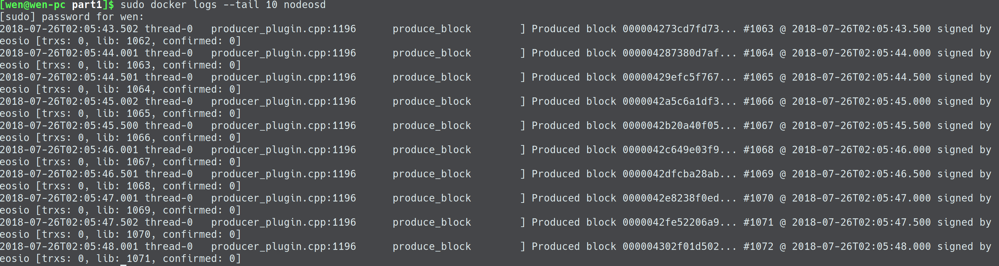
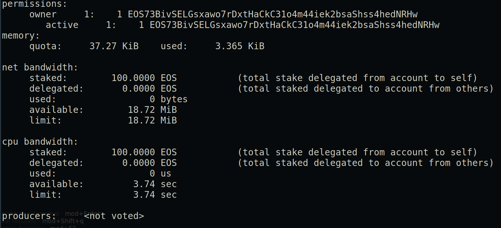

# Introduction

EOS being a newborn in blockchain space, promises to deliver vertical and horizontal scaling of decentralized applications unmatched by the other Blockchain platform out there. The technology and infrastructure of the EOS blockchain will eventually have the capability of driving millions of transactions per second through a fast DPos - Delegated Proof of Stake - consensus algorithm. At EOS9CAT, we are developing applications with the amazing technology. We feel that it's absolutely crucial to share our experience and hope to inspire you to build something of your own. 

# Setting Up

The EOS developement ecosystem currently features three main toolset to interact the blockchain:
* **Nodeos** is a daemon that is used to host and run EOS node.
* **Keosd** is a light-weight wallet client responsible for protecting keys and signing transactions with them. 
* **Cleos** is a command line tool to interact with EOS blockchain and serves as bridging component between Nodeos and Keosd.


## Step One: Building EOS

Make sure your system has 8GB of RAM and 20GB of free hardware space.


#### Install Docker and Docker-compose

Docker is a container management service that runs on top of the os kernel to allow for easy applicaiton development and deployment by allowing developers to synthesis a sandbox environment with fine-tuned system environments, variables, and packages.

In order for the to develop with docker containers, it's neccessary to install the necessary files and programs, please follow this guide: https://docs.docker.com/install/ and install docker for your corresponding os.

### Option 2(Build with Docker Compose)

Create a file called docker-compose.yaml with the following content:

```
version: "3.5"

services:
  nodeosd:
    container_name: nodeosd
    image: eosio/eos-dev:latest
    command: /opt/eosio/bin/nodeosd.sh --data-dir /opt/eosio/bin/data-dir -e --access-control-allow-origin=* --contracts-console --http-validate-host=false
    hostname: nodeosd
    ports:
      - 8888:8888
      - 9876:9876
    expose:
      - "8888"
    volumes:
      - ./nodeos-data-volume:/opt/eosio/bin/data-dir
    networks:
      - eosio

  keosd:
    container_name: keosd
    image: eosio/eos-dev:latest
    command: /opt/eosio/bin/keosd --wallet-dir /opt/eosio/bin/data-dir --http-server-address=127.0.0.1:8900 --http-validate-host=false
    hostname: keosd
    volumes:
      - ./keosd-data-volume:/opt/eosio/bin/data-dir
    networks:
      - eosio
    
networks:
  eosio:
    name: eosio
```

#### Start Nodeos and Keosd

Run command:
```
docker-compose up -d
```

* **d** flag allows the containers to be run in detached mode (as a daemon in the background)

The above command will essentially spawn two containers base on the eosio-dev docker image with one of each running the Nodeos client responsible for interacting with the blockchain and Keosd for managing the wallet. EOSIO provides a Docker image on docker hub - which is the equivalent of Github for Docker - that is pre-packaged with the neccessary toolset needed for developing smart contracts for the EOS blockchain.

*Note: EOS also offers a eosio docker image on Docker Hub which is significantly smaller in size in comparison to the dev image. The the dev image will be crucial in smart contract development because it contains eosiocpp which is the essential compiler for translating C++ code into web assembly code understandable by EOS blockchain.*

run the following command to check if the node is working properly:
```
sudo docker logs --tail 10 nodeosd
```

The output should be similar to the following screenshot:


If you would like to stream the logs, you can attach back to the container of nodeosd with the command:

```
sudo docker container attach nodeos
```

or simply:

```
sudo docker logs -f
```

Finally, check the this address in the host browser to ensure that the RPC interface and port binding is working as expected:

```
http://localhost:8888/v1/chain/get_info
```

The browser should return a json object that should be similar to this:



#### Set alias

Run following command to set-alias:

```
alias cleos='docker exec -i keosd /opt/eosio/bin/cleos -u http://nodeosd:8888 --wallet-url http://localhost:8900'
```

Since the cleos alias is set to execute process in the keosd container environment, the **wallet-url** flag is set to localhost of port 8900, and the **u** flag is set to point to the address where nodeos is running, which in this instance is another container. 

Verify the alias set correctly.


## Step Two: Create Accounts

In order to create accounts, you will need two pairs of keys: owner key pair and active key pair. Each account has a owner key pair and an active key pair. Active key pair is for signing transactions and owner key pair is responsible for the account ownership.

### Create Keys:

Run the following command twice to generate two pairs of keys:

```
cleos create key
```

You should recieve the following output signaling the successful createion of private and public key pair:

```
$ cleos create key
Private key: 5JGKHd79fsS5QKDemJYqEGwpDeADooVBGFbEcahJmEgRiXFbBBQ
Public key: EOS7XnZdBp4V2yRgSUhCMXRhVGfZQcHpa828xpTiyMX4BLUQdu28B
```

### Create Wallet:

Wallet is a place where you store all of your key pairs which may or may not associate with the permission of one or more accounts.

```
cleos wallet create
```
A default wallet will generated after passing the command, you can also speicify the name of a generated wallet by passing a the **n** flag along with the name as a argument.

wallet can be unlocked and locked by invoking following commands:
```
cleos wallet lock
```
```
cleos wallet unlock --password ${passphrase}
```
By default, a wallet will be immediately unlock after its createion, and a locked wallet will require the passphrase generated during wallet creation to unlock.

The list the current available wallet, run the command:
```
cleos wallet list
```

An array of wallet name like the above will be returned:
```
[
  "default *"
]
```

The asterisk besides the wallet name indicates that the wallet is currently unlocked and available.


### Import Key Pairs into Wallet:

Now that we a wallet and couple of key pairs generated, it's time to import the keys into the wallet. Run the following command twice and each time with a private key generated before.
```
cleos wallet import ${private key}
```

### Import Authorizing Account Key:

Since the actions performed on the blockchain must be signed using the keys associated the authorizing account(producer), we can mimic this interaction by createing a separate wallet that will import the producer's private key found within the config.ini file inside the container.

```
cleos wallet create -n producer
```

By default this should be the private key associated with the authorizing account eosio:
```
cleos wallet import -n producer 5KQwrPbwdL6PhXujxW37FSSQZ1JiwsST4cqQzDeyXtP79zkvFD3
```

Run the following command to ensure that all the keys are properly imported:
```
cleos wallet keys
```


### Generate Account:

This is where keys, wallet and account all tie together. In EOS blockchain, your token, smart contract all live in your account. Each account has a owner key pair and active key pair. Active key pair is for signing for transaction and own key pair is for the account ownership. Run the following command to create an account:

```
cleos create account eosio ${accountName} ${owner public key} ${active public key}
```

In the above command line, the first key will become the account owner key and the second key will become the active key.

*Note: although that the owner public key and active public key can be the same, it's highly recommended to use two different keys in production environment for security purpose.*

Since the eosio::history_api_plugin is installed, we can run the following command to query all the accounts that are associated with a public key:


Once you have the account ready, you are all set for the development environment.
```
$ cleos get accounts ${public key}
```


## Step Three: Loading the Bios Contract

Now that the wallet and accoutns are properly set up, it's time to deploy the system contract. For the purpose of the tutorial **eosio.bios** will be used, the contract can be found within the folder of /contracts/ inside the container. In the public EOS blockchain, system contract is used manage the staking and unstaking of tokens and reserve bandwidth for CPU and network activity, and memory for contracts. Again, we'll be using the eosio producer account crediential to sign off the contract deployment.

Run command:

```
cleos set contract eosio /contracts/eosio.bios -p eosio@active
```
*Note: Please be aware that the contract location argument refers to the path within the keosd container, and not the path of host machine*

The similar output of the following will denote the successful deployment of the contract:

```
Reading WAST/WASM from /contracts/eosio.bios/eosio.bios.wasm...
Using already assembled WASM...
Publishing contract...
executed transaction: 7dde788c5c75a08ee0e1ebbd7865ad43861b77386372f028db4ab99f930004eb  3728 bytes  7811 us
#         eosio <= eosio::setcode               {"account":"eosio","vmtype":0,"vmversion":0,"code":"0061736d0100000001621260037f7e7f0060057f7e7e7e7e...
#         eosio <= eosio::setabi                {"account":"eosio","abi":"0e656f73696f3a3a6162692f312e30050c6163636f756e745f6e616d65046e616d650f7065...
```

*Note: the arguments passed with the alias will refer to the environment variable and path that's associated with container context instead of the host.*

## Final Remark

If the EOS blockchain needs to be shut down, you'll should do it gracefully by issuing the following command.
```
docker-compose down
```

In scenarios in which the EOS blockchain, more specifically nodeosd the daemon that's responsible for running the node, you might get a database is dirty flag which prohibits the nodeosd from resuming after a shutdown. You'll have to run the following command to run nodeos with the added flags of --replay-blockchain --hard-replay-blockchain

```
docker-compose run --name nodeosd -p 8888:8888 nodeosd /opt/eosio/bin/nodeosd.sh --data-dir /opt/eosio/bin/data-dir -e --access-control-allow-origin=* --contracts-console --http-validate-host=false --replay-blockchain --hard-replay-blockchain

docker-compose run --name keosd keosd

```

Now that we have everything set up, it's time to move on to the next stage of actually writing and deploying  smart contracts in EOS ecosystem. Stay tune for EOS9CAT's next article.
