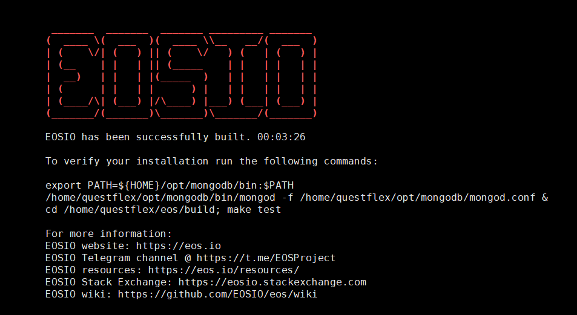
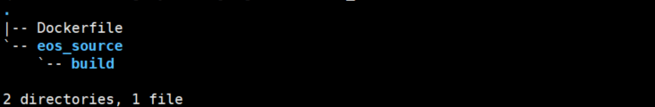
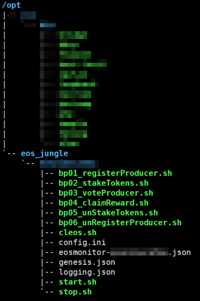
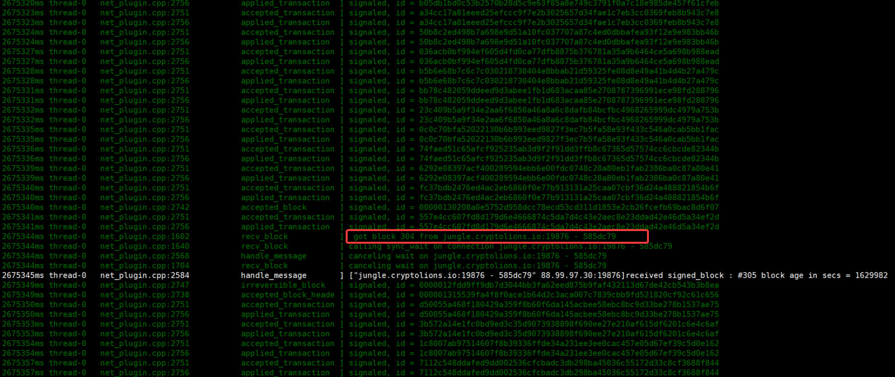
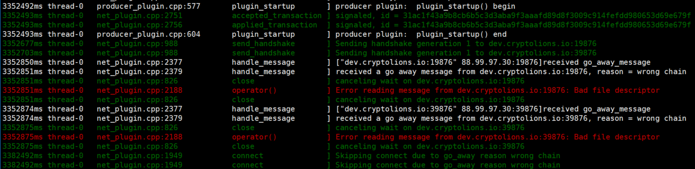

# How to build BP like a boss (Build Docker Image)

- [How to build BP like a boss (Build Docker Image)](#how-to-build-bp-like-a-boss-build-docker-image)
    - [Briefing](#briefing)
    - [Step1: Building EOSIO](#step1-building-eosio)
    - [Step2: Creating `Dockerfile`](#step2-creating-dockerfile)
    - [Step3: Building Docker Image](#step3-building-docker-image)
    - [Step4: Validation and Trouble-shooting](#step4-validation-and-trouble-shooting)
    - [Contact](#contact)

Nowadays EOS becomes the most popular block chain platform in the world. More and more people are joining the community and would like to build up their own node to do more experiment on this new generation block chain.

Today we would like to share the experience of how to build the EOS docker and why this is the best way to do. This article won't be only the simple instruction, but also the prerequisite of our Kubernetes infrastructure in the future. 

Please follow us and stay tuned.

Last but not least, the test net we are going to run is the [Jungle Testnet](http://dev.cryptolions.io/) ([GitHub](https://github.com/CryptoLions/EOS-Jungle-Testnet)). 

**The approach we are using could also be identically applied to the main net.**

## Briefing

The dev environment we are using:

- OS: **Ubuntu 16.04 LTS**
- Docker: **CE 17.03.x** *(the version compatible with Kubernetes 1.10.x)*
- EOS Net: **Jungle Testing Net**

Reference: [EOSIO Wiki - Local Environment](https://github.com/EOSIO/eos/wiki/Local-Environment)

Actually EOSIO officially has very detail instruction about how-to build the local environment from the source code as well as how-to build the EOSIO image.

In terms of the `Dockerfile` ([GitHub](https://github.com/EOSIO/eos/blob/v1.0.7/Docker/Dockerfile)) from EOSIO, the docker will compile all the code during the image building from the `master` branch (hard coded). This is not what we want. By our design, we want to keep the image size as small as possible.

The steps we are going to follow:

- Step1: Building/Compiling EOSIO Source code
- Step2: Creating `Dockerfile`
- Step3: Building Docker Image
- Step4: Wrap-up, Validation and Trouble-shooting

## Step1: Building EOSIO

First of all, let's compile and build the EOSIO.

**System Requirements (all platforms)**

- 8GB RAM free required
- 20GB Disk free required

Here is the example to compile the code from the `tag v1.0.7`

`$ cd ~`

`$ git clone https://github.com/EOSIO/eos.git --recursive`

`$ cd eos`

`$ git checkout v1.0.7`

`$ git submodule update --init --recursive`

`$ ./eosio_build.sh`



Once the build is completed successfully, we could find a new folder - `build` under the folder and this is the folder we will use to build our docker image.

## Step2: Creating `Dockerfile`

Learning from the EOSIO official `Dockerfile`, we could find some interesting points as below.

1. expose the ports for the `http` and `p2p` (and `bnet`, if necessary)
2. mount volume for the `data-dir`
3. entry point is the command - `nodeosd.sh -e arg1 arg2`

Let's prepare the building folder

`$ cd ~ && mkdir -p docker_build/eos_source`

`$ mv ./eos/build ./docker_build/eos_source/`

`$ cd docker_build && touch Dockerfile`

Copy the content below into the file `Dockerfile`

```dockerfile
FROM ubuntu
RUN mkdir -p /opt/eos_jungle/data_dir \
    && cd /opt/eos_jungle
WORKDIR /opt/eos_jungle
COPY ./eos_source/ /opt/eos_jungle/eos_source/
EXPOSE 8888/tcp
EXPOSE 9876/tcp
EXPOSE 9875/tcp
VOLUME /opt/eos_jungle/data_dir
ENTRYPOINT ["/opt/eos_jungle/eos_source/build/programs/nodeos/nodeos", "--data-dir", "/opt/eos_jungle/data_dir", "--config-dir", "/opt/eos_jungle/data_dir", "--genesis-json", "/opt/eos_jungle/data_dir/genesis.json"]
```

- `/opt/eos_jungle/eos_source/build` is the working folder for the EOSIO program.
- `/opt/eos_jungle/data_dir` is the folder which will be mounted from external to persistently keep the `config.ini`, `genesis.json` and other data files.
- Expose `8888/tcp` for http endpoint, `9876/tcp` for p2p and `9875/tcp` for bnet.
- The `nodeos` command will be executed once after the docker container is brought up.

**Caveat**

**It's very important to make the `nodeos` command as the entry point. Otherwise, when the container is shutdown or stop, the `nodeos` won't get the `SIGNTERM` from the docker, and if the `nodeos` is NOT shut down gracefully, block database can NOT be used again and the node has to spend time to resync with the other nodes.**

**We will have another article specifically talking about the node start-up, shutdown, resume.**

In the end, the structure of the docker build folder will be like the picture below.



## Step3: Building Docker Image

Run the command below to build the image.

`$ docker build -t eos9cat/eosio-junglenet:v1.0.7 .`

You may replace the image name and the version tag with your own.

## Step4: Validation and Trouble-shooting

Before we run the docker image we built just now, we must get the `data-dir` working folder ready.

When we [Create Account](http://dev.cryptolions.io/#account) and [Register](http://dev.cryptolions.io/#register) on the [Jungle3 EOS Network Monitor (CryptoLions.io)](http://dev.cryptolions.io/#home), the website will help you create the bash script according to the information you fill into the form (e.g. p2p listen endpoint, p2p server address, http server address, etc).

After we went through the script, we found that it created the `start.sh` for the `nodeosd` and the `keosd`, and the script for the `wallet` and the `cleos`. Another important thing was that the script created the `config.ini` and the `genesis.json`.

Something looks like below.



Below is the **`config.ini` [(GitHub)](https://github.com/CryptoLions/EOS-Jungle-Testnet/blob/master/config.ini)** for the reference:

```ini
#EOS Jungle Testnet Config file. Autogenerated by Jungle monitor.

    get-transactions-time-limit = 3
    blocks-dir = "/opt/eos_jungle/data_dir/blocks"

    http-server-address = 0.0.0.0:8888
    p2p-listen-endpoint = 0.0.0.0:9876
    p2p-server-address = !!!NODE_IP_ADDRESS!!!!:9876

    chain-state-db-size-mb = 8192

    p2p-max-nodes-per-host = 100

    access-control-allow-origin = *
    # access-control-allow-headers =
    # access-control-max-age =
    # access-control-allow-credentials = false

    # actor-whitelist =
    # actor-blacklist =
    # contract-whitelist =
    # contract-blacklist =
    # filter-on =

    # SSL
    # Filename with https private key in PEM format. Required for https (eosio::http_plugin)
    # https-server-address =
    # Filename with the certificate chain to present on https connections. PEM format. Required for https. (eosio::http_plugin)
    # https-certificate-chain-file =
    # Filename with https private key in PEM format. Required for https (eosio::http_plugin)
    # https-private-key-file =

    allowed-connection = any

    log-level-net-plugin = info
    max-clients = 150
    connection-cleanup-period = 30
    network-version-match = 1
    sync-fetch-span = 2000
    enable-stale-production = false

    max-implicit-request = 1500
    pause-on-startup = false
    max-transaction-time = 60
    max-irreversible-block-age = -1
    txn-reference-block-lag = 0
    unlock-timeout = 90000

    mongodb-queue-size = 256
    # mongodb-uri =

    # peer-key =
    # peer-private-key =

    plugin = eosio::producer_plugin
    plugin = eosio::chain_plugin
    plugin = eosio::chain_api_plugin
    plugin = eosio::history_plugin
    plugin = eosio::history_api_plugin

    #plugin = net_plugin
    #plugin = net_api_plugin

    #BNET
    #plugin = eosio::bnet_plugin
    #bnet-endpoint = 0.0.0.0:<!!BNET_PORT!!>
    #bnet_threads = 4
    #bnet-connect = bnet.cryptolions.io:19875
    #bnet-connect = bnet.cryptolions.io:39875
    #bnet-connect = 193.93.219.219:9875
    #bnet-connect  = 94.154.212.15:9877

    plugin = eosio::producer_plugin # for BP node
    signature-provider = YOUR_PUB_KEY_HERE=KEY:YOUR_PRIV_KEY_HERE # for BP node
    producer-name = !!_YOUR_PRODUCER_NAME_!!! # for BP node

#EXAMPLE peers please chek last one on http://dev.cryptolions.io/#p2p
p2p-peer-address = dev.cryptolions.io:19876
p2p-peer-address = dev.cryptolions.io:39876
```

**Note: In terms of different role of the nodes, full node and BP node have different `config.ini` file. We will have another article talking about it.**

**`genesis.json` [(GitHub)](https://github.com/CryptoLions/EOS-Jungle-Testnet/blob/master/genesis.json) for Junglenet**

```json
{
  "initial_timestamp": "2018-06-09T00:00:00.000",
  "initial_key": "EOS6CttW6XFfeRXaiqbD1Hoc9xPfVJrJ9RVZqA8tNTDLriNEyamFY",
  "initial_configuration": {
    "max_block_net_usage": 1048576,
    "target_block_net_usage_pct": 1000,
    "max_transaction_net_usage": 524288,
    "base_per_transaction_net_usage": 12,
    "net_usage_leeway": 500,
    "context_free_discount_net_usage_num": 20,
    "context_free_discount_net_usage_den": 100,
    "max_block_cpu_usage": 200000,
    "target_block_cpu_usage_pct": 1000,
    "max_transaction_cpu_usage": 150000,
    "min_transaction_cpu_usage": 100,
    "max_transaction_lifetime": 3600,
    "deferred_trx_expiration_window": 600,
    "max_transaction_delay": 3888000,
    "max_inline_action_size": 4096,
    "max_inline_action_depth": 4,
    "max_authority_depth": 6
  }
}
```

Finally, we could start up our docker image.

**Start the Docker**

`docker run -d --name nodeos -v /opt/eos_jungle/your-jungle-account:/opt/eos_jungle/data_dir -p 8888:8888 -p 9876:9876 -p 9875:9875 eos9cat/eosio-junglenet:v1.0.7`

**Validate the Docker**

`docker logs nodeos`



**Get chain info**

`curl http://127.0.0.1:8888/v1/chain/get_info`

```json
{
  "server_version":"90fefdd1",
  ...
}
```

**Trouble-shooting**

1. From the chain info, we could have the `server_version`, and the `chain_id`.

    - `server_version` is the hash of the commit of the EOSIO, for this demo, it's commit hash of the `tag v1.0.7`.

2. The node got the error message - `Bad file descriptor` or `go_away_message`.

    

    Start the `nodeos` with `--delete-all-blocks` to clear chain state database and block log, and also please check whether the `genesis.json` is correct for the chain.

3. The node is crashed and unable to synchronize with the other nodes.

    Start the `nodeos` with the `--hard-replay` to clear chain state database, recover as many blocks as possible from the block log, and then replay those blocks.

    In case `--hard-replay` fails, please remove blocks/reversible folder and try `--hard-replay` again

**Now our docker of the EOS node is up and synchronizing with the other EOS nodes!!! Hoopla, happy block producing!!!!** 

**Next time, we are going to talk about how to take the snapshot of the node and how to restore the snapshot.**

## Contact

If you have any questions or anything you would like us to do, please feel free to leave the comment.
If you are interested in running and maintaining a BP node, we are more than happy to help you.
If you think our content helps you, don't forget to vote for us - eosninecatbp. ;)

{{TODO: contact info}}

