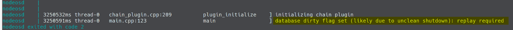
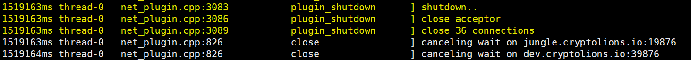
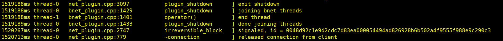

# Reason and Solution for `the database dirty flag set` and Snapshot Backup/Restore

## `nodeos` - the right way to start/stop

We saw lots of different infrastructure architecture of the EOS nodes in  community. Most of them are using the `docker` as we are. One of the frequently asked questions is that when the node docker is stopped, the node couldn't be restarted properly, the most common error is `database dirty flag set`.



Referring to our documentation of [How to build BP like a boss (Build Docker Image)]() {{TODO}}, we mentioned the reason that why that error happened and what was the best way to resolve the issue.

> **Caveat**
> 
> It's very important to make the `nodeos` command as the entry point. Otherwise, when the container is shutdown or stop, the `nodeos` won't get the `SIGNTERM` from the docker, and if the `nodeos` is NOT shut down gracefully, block database can NOT be used again and the node has to spend time to resync with the other nodes.
> 

Here is the demonstration of the shut-down process
In terms of the EOS source code, the `nodeos` will take the corresponding action, when it traps the `SIGNTERM` from the operation system.

* The `net_plugin` traps the **shutdown** signal and **close** the connections

* The `bnet_plugin` will also take the corresponding action to **end** the thread.


That's the only way to gracefully shutdown the `nodeos` and only after that, the database won't set the dirty flag and is able to be started again.

Usually the `start/stop` scripts downloaded from the Internet are using the same method, but the process requires the human intervention. That's why, if the docker image was built up with that scripts, the `database dirty flag set` issue consistently happens, when started or stopped by the `docker run` or `docker stop`.

Below is the `dockerfile` we use to build our image, quoting from the [How to build BP like a boss (Build Docker Image)]() {{TODO}}

```dockerfile
FROM ubuntu
RUN mkdir -p /opt/eos_node/data_dir \
    && cd /opt/eos_node
WORKDIR /opt/eos_node
COPY ./eos_source/ /opt/eos_node/eos_source/
EXPOSE 8888/tcp
EXPOSE 9876/tcp
EXPOSE 9875/tcp
VOLUME /opt/eos_node/data_dir
ENTRYPOINT ["/opt/eos_node/eos_source/build/programs/nodeos/nodeos", "--data-dir", "/opt/eos_node/data_dir", "--config-dir", "/opt/eos_node/data_dir", "--genesis-json", "/opt/eos_node/data_dir/genesis.json"]
```

## Snapshot Backup/Restore

With the blocks growing every seconds, the EOS node needs more and more time to re-sync or catch up with the other nodes from the 1st block on the net. Backing up the snapshot to be used when the incident happens becomes a critical challenge for each EOS node. 

As we all know, backing up the running node is useless. The database will be flagged invalid to start again. Now that we understand the reason why the problem happens, we could arbitrarily start/stop the EOS node without any damage. Then that makes the **backup/restore** easy-peasy.

### Backup

After we **stop** the node peacefully, we run the command such as below to do the backup.

```sh
BACKUP_DATE_TIME=$(date +%Y%m%d_%H%M%S)
rsync -avhP --delete $SOURCE_DIRECTORY/ $DESTINATION_DIRECTORY --log-file=/var/log/rsync/backup_${BACKUP_DATE_TIME}.log
```

- `$SOURCE_DIRECTORY/` is the EOS `--data-dir` folder in the host mounted into the docker;
- `$DESTINATION_DIRECTORY` is the folder we save the backups;
- `BACKUP_DATE_TIME` is the backup data and time;

Once the backup is completed, we could easily **start-up** the node again.

### Restore

It's the same that let's **stop** the node first, and run the command such as below to do the restore.

```sh
RESTORE_DATE_TIME=$(date +%Y%m%d_%H%M%S)
rsync -avhP $SOURCE_DIRECTORY/ $DESTINATION_DIRECTORY --log-file=/var/log/rsync/restore_${RESTORE_DATE_TIME}.log
```

- `$SOURCE_DIRECTORY/` is the folder we save the backups;
- `$DESTINATION_DIRECTORY` is the `--data-dir` folder of the EOS node in the host mounted into the docker;
- `RESTORE_DATE_TIME` is the restore data and time;

Once the restore is completed, we could easily **start-up** the node again from the last stop point.

## Contact/About us

{{TODO}}
