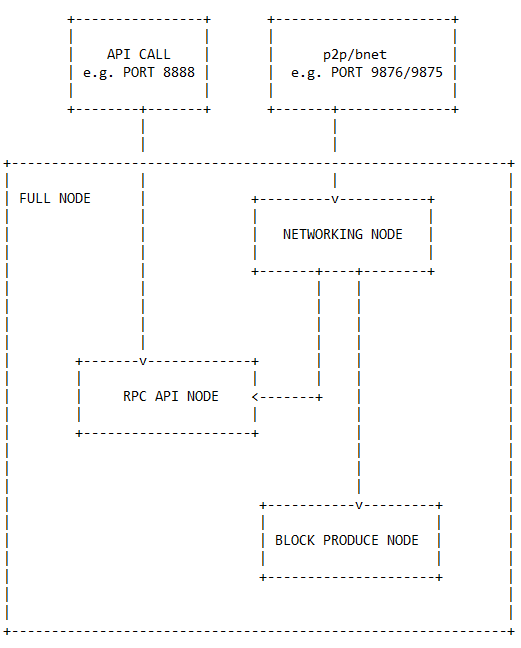

# Best Practice: Role of EOS Node

- [Best Practice: Role of EOS Node](#best-practice-role-of-eos-node)
  - [Briefing](#briefing)
  - [Discussion](#discussion)
  - [Learning Notes](#learning-notes)
  - [BONUS](#bonus)

## Briefing

When EOS9CAT prepared the EOS nodes before the EOS main net launch day, we noticed that the EOS node probably could be separated into different roles not only on the main net but also in the on-premise infrastructure.

From the EOS main net perspective, the role of the node is divided into **"Producing Node"** and **"Non-Producing Node"**.

Do a simple search, below is the definition of the **Non-Producing Node** from the [EOSIO Wiki Page - Glossary](https://github.com/EOSIO/eos/wiki/Glossary).

> **Non-Producing Node**
> 
> A full node running `nodeos` that is only watching and verifying for itself each block, and maintaining its own local full copy of the blockchain. A non-producing node that is in the "standby pool" can, through the process of being voted in, become a producing node. A producing node, if voted out, will become a non-producing node. Most non-producing nodes are not in the "standby pool".

So the **Producing Node** is the opposite of the **Non-Producing Node**. The **Producing Node** definitely is voted in and producing the blocks. However, it doesn't mean the **Non-Producing Node** is not capable of producing the blocks. It means that the **Non-Producing Node** is a **full node** and is capable of doing so on demand. Whenever the chain needs to replace an existing Block Producer with a new one, the new one is drawn from the standby pool.

As you may notice that we have another terminology - **full node**. What does "full node" mean? Obviously it means the node has the full functionality. Then what is the "full functionality"? This is what we are going to talk about today.

## Discussion

EOS9CAT has run the nodes on the main net and the jungle net (testing environment) since Day One. With the block logs file is growing bigger and bigger and more and more transactions are signed into the blocks, maintaining all the nodes as the **full node** isn't a good idea. Huge amount of P2P synchronization traffic and API visit traffic together will cause the nodes corrupted unexpectedly and make the node to take lots of time to re-sync or replay.

Let's dive deeper. Simply, a **full node** has such functionality as below:

- Networking (p2p/bnet)
- RPC API
- Block Produce

Each functionality is implemented by bunch of the plugins.

| Plugin Name | Description | Functionality | Dependency |
| ----------- | ----------- | ------------- | ---------- |
| `chain_plugin` | The `chain_plugin` is a core plugin required to process and aggregate chain data on an EOSIO node. | Network | none |
| `chain_api_plugin` | The `chain_api_plugin` exposes functionality from the `chain_plugin` to the RPC API interface managed by the `http_plugin` | RPC API | `chain_plugin` |
| `bnet_plugin` | The `bnet_plugin` provides an p2p protocol to persistently synchronize two blockchains  | Network | none |
| `history_plugin` | The `history_plugin` provides a cache layer for blockchain objects that are useful for obtaining historical data.  | RPC API | `chain_plugin` |
| `history_api_plugin` | The `history_api_plugin` exposes functionality from the `history_plugin` to the RPC API interface managed by the `http_plugin` | RPC API | `history_plugin` and `chain_plugin` |
| `producer_plugin` | The `producer_plugin` loads functionality required to for a node to produce blocks. | Block Produce | `chain_plugin` |

Thus, let's go back to the first paragraph of the article.

From on-promise perspective, what EOS9CAT is doing now is playing a full node with  several different minor nodes.

| Node Role | Description |Enabled Plugin | Connectivity |
| --------- | ----------- | ------------- | ------------ |
| Networking | Synchronize the chain | `bnet_plugin` and `chain_plugin` | Expose p2p/bnet ports |
| RPC API | Provide the RPC API for the `history` and `chain` | `chain_plugin`, `history_plugin`, `chain_api_plugin` and `history_api_plugin` | Expose API (http) port |
| Block Produce | Produce the blocks  | `chain_plugin`, `producer_plugin` | None |

## Learning Notes

1. **Networking Node** is available to both external and internal.
2. **RPC API Node** and **Block Produce Node** only need to connect to the **Networking Node** internally, NOT necessarily to expose the p2p/bnet port externally.
3. The snapshot from different roles of the nodes may **NOT** be used for each other. *(need more verification)*
4. Moreover, each role of the node could be a cluster or replicas which is able to help the node runner to achieve the maximal high availability. 
5. `chain/history` API reference - [EOS RPC API](https://developers.eos.io/eosio-nodeos/reference#get_info)

## BONUS

Since [EOS Release v1.1.0](https://github.com/EOSIO/eos/releases/tag/v1.1.0), we could start use the `mongo_db_plugin`, although the documentation about it is not much.

> MongoDB Plugin
> 
> The MongoDB Plugin (`eosio::mongo_db_plugin`) is an optional plugin that provides archiving of blockchain data into a MongoDB. This creates a read-only copy of the data in the blockchain that enables highly-scalable and convenient queries on that data.

After first glance, we are so excited that it's really a good plugin to use and will improve the EOS node to be more reliable. So EOS9CAT will do some testing with this plugin and keep you posted. Please stay tune and see you in the next article.

