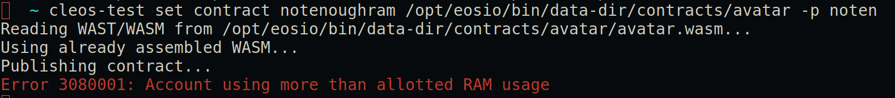

### What is the whole big deal about RAM.

We often see the word "RAM" juxtaposed next to EOS on daily crypto newsfeed, but what the heck is RAM anyways and why should we keep an eye on its price even for the folks who just only want to dive their heads down into smart contract development. There essentially three type of resources in eos - bandwith and log storage(disk), computation and computational backlog(CPU) and state storage(RAM). RAM is essentially the gas that fuels each transaction invoded within the smart contract, unlike disk and cpu which are fractional resources acquired through staking tokens, RAM is one which need to be purchased from eosio.ram with a price pre-deteremined by the Bancor algorithm. The Bancor algorithm will dynamically facilitaet the price base on the current demand and supply of RAM and settles it at a market equilibrium. Therefore, all transaction to buy and sell ram is unilateral transaction with eosio.ram. The secondary ram market incentivizes those will RAM reserves that has no use of it to sell it to thsoe that needs them. Because eosio endorses a free-for-user philosophy, the burden of running the network falls on the developers. We need to reserve enough RAM for our smart contracts to function properly on the eos network.  


### Buy Ram

Throughout our smart contract development on the EOS platform, we may encounter a situation in which the RAM that we are allocted doesn't fulfill the requirement for deployting the contract. In such a cases, we'll need to purchase additional ram with EOS token in order to proceed with contract deployment. This entire process can be accomplished with the cli tools,namely keosd and cleos, provided by eos-io. In our previous articles we have went through the procedure of setting up a local development environment for testing smart contracts. If you have followed those steps, we can interact with main-net and test-net with the same tools with a few configuration changes.

Let's start by pointing our cleos application to a test-net node instead of our local running nodeosd. We can create an additonal alias to register this configuration.

```
alias cleos-test='docker exec -i keosd /opt/eosio/bin/cleos -u http://jungle.eos9cat.com:8888 --wallet-url http://localhost:8900'
```

In the above command, we have created the alias `cleos-test` to quickly interact with the eos test-network node provided by eos9cat. Notice that we are still relying our local wallet application for handling our private keys. As long as we have the corresponding private key imported in an unlocked wallet.

*Tips: If you want to save the command persistantly, you can put the command inisde of the file ~/.bashrc if you are on linux and ~/.bash_profile for mac.*



Somtimes when you deploy the an application contract that contains more complex logic, you might get a error message similar to the above screenshot hinting that the smart contract account has insufficient ram to deploy the contract. Unlike 
In such a case, we have to buy more ram from the eosio.ram.

We can first quickly check our ram allocation by issueing the following command:
```
cleos-test get account ${accountname}
```


The quota attribute under the memory section indicates the amount of ram that the account allotted.

Now that we know how much ram we are entitled to, how can we possibly know how much ram we need to deploy our smart contract. Since the eosio blockchain execute user-generated applications and code using WebAssembly, we can get a rough estiamte about the amount of kilobytes needed to executed the smart contract by summing the size of *.wasm and *.abi files. In addition to figuring the rough estiamte, we will probably have to determine the amount eos token that will be required to purchase the ram.

The eos blockchain platform relies on the Bancor Algorithm to faciliate the secondary ram market through a unilateral transaction model, we can determine the eos ram price by consulting rammarket table exposed by the system contract and performing some simpe calculation.


To acquire the EOS/KiB, we need to divide the `quote.balance` - the connector balance - by the `base.balance` - the ram token outstanding supply and finally mulitple the value by 1024 `(quote.balance/base.balance)*1024. `

In my example with the smart contract that I wanted to deploy will require around 100 kib which will cost around 31.70 EOS token. We can then proceed with the actual transaction by issuing the following command through cleos.

```
cleos-test system buyram -k ${payer} ${reciever} amount
```

The `k` flag will indicate the amount parameter indicates the amount of kib to purchase, the system contract transaction will automatically deducted the appropriate amount of EOS token from the payer's account. Without the `k` flag, the amount will indicate the amount EOS token wishing to be spent. Likewise, an appropriate amount of ram will be added to the account according to the ram price. 


If we now deploy the contract again it should succeed.


### Selling Ram

For the unneeded ram that the account is currently occupying, it's possbile to exchange the resource for some EOS token through the system contract by a price settle by the Banchor Algorithm. Selling ram is a similar process to buying ram on eos blockchain.

```
cleos-test system sellram ${account} bytes
```

A successful transaction will look similar to this:


### Persistent Stroage

RAM is arguably the single most sought-after resoruce on the eos blockchain platform due to its flexibility. Not only RAM can be used for store intermediate states of computation, it can also be used as a persistent storage. The multi-indexed database is a data structure within eos that 
provides flexiblity in where the data is stored depending on how the scope is defined. Multi-indexed db will house the persistent data in a table format. In fact unlike many other popular smart contract plaforms, the transactions within the eos smart contracts cannot return any value or variable, which mean any data captured by RAM cannot be returned to the caller by transaction. In order to gain access to the variable value within the smart contract - e.g. result of a certain computation and transaction -  the data needs to be updated through an multi-index db table with a scope, an associative link to the data stored nomrally in the form of account name of the caller or the account name of the smart contract itself, then the data can be retrieved by `get table` chaincode api with the appropriate contract name, scope and name of the table. 

For example, the amount of EOS tokens that each account has is stored in the the multi-indexed db defined within the eosio.token contract that composes of a small chunk of RAM from each the account defining the scope. We can retrieved the amount of token that a certain account has directly from the db with following command:

```
cleos-test get table eosio.token ${account} accounts
```


The table name in the above command is accounts, and the scope is the individual account name. It's logical to assign the account balance information with the account that acutally owns them. On the other hand, if we wish to retrieve information about the EOS token itself, we'll need to look into another scope with a different table even though the information is encoded within the same smart contract:

```
cleos-test get table eosio.token EOS stats
```

Determing the scope and table name can be tricky espeically for contracts that are produced by others, the table name can normally be quickly retrieved through looking at the abi of the contract.


The scope is harder, but it can be determined through looking through the parameter when the reference to the multi-indexed db is made within the code. 


The first underlined part shows the reference to the stats table is made with sym parameter which denotes the SYMBOL of the token; hence the scope of the table is the SYMBOL of the token.

The first underlined part depicts the line that makes the reference to the accounts table when the balance is subtracted during a transaction. This line of code hints that the scope of the table accounts is an account name. For more tutorial and information about using multi-index db within smart contracts, please stay tune for our next article. 


### Upgrade Contract
Since the conection between the smart contract itself to the mulit-index db stored on local disk is merely a reference link, this feature in conjunction with the deploy a contract multiple times with the same account grants the feature to upgrade smart contracts in the eos ecosystme. The reference to the data can be made in the new smart contract as long as key features that defines the multi-index db is identical accross the old and new smart contract. 

In some cases, you may even find it useful to free up RAM for sales by deploying an empty contract or one that is significantly less in size while still keeping the data related to the former contract on persistent storage. 


## References:

https://www.youtube.com/watch?v=N6CTRdx6NVE


https://medium.com/@bytemaster/eosio-ram-market-bancor-algorithm-b8e8d4e20c73