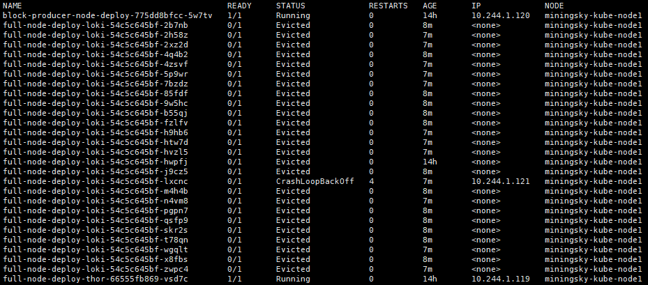
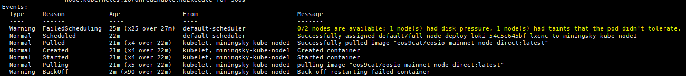
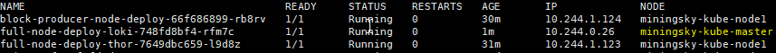
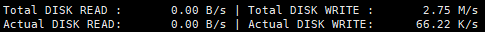
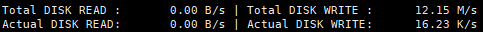

# POD evicted and unable to be launched again


## Briefing

When we did the regular check on our official EOS node on the main-net, we found that one full node was evicted and can't be launched again. Obviously the node was shut down and not working.

## Symptom

#### Status of the Pod

`kubectl get po -owide`



`kubectl describe pod <pod-name>`



We found one funny factor that -

> 0/2 nodes are available: 1 node(s) had disk pressure, 1 node(s) had taints that the pod didn't tolerate.

Note: EOS9CAT currently has 1 x master node (pod not tolerated) + 1 x worker node.

## Reason

> The `kubelet` needs to preserve node stability when available compute resources are low. This is especially important when dealing with incompressible compute resources, such as memory or disk space. If such resources are exhausted, nodes become unstable.

Running 2 x full nodes + 1 bp node on one server seems that exhausted the disk I/O (SSD already).

In terms of EOS9CAT monitoring, after the EOS main-net was officially launched for more than 1 month, more and more transactions are being made into the blocks.

Currently the nodes require very high network bandwidth and disk I/O than we expected before the EOS launching day.

## Workaround

1. Enable the master node to hold the pods

    Reference: [Creating a single master cluster with kubeadm - Master Isolation](https://kubernetes.io/docs/setup/independent/create-cluster-kubeadm/#multi-platform)

    `kubectl taint nodes --all node-role.kubernetes.io/master-`

2. Re-configure the Persistent Volume for the master node

    - Change the nfs server address to be same with the master node

      ```yaml
      nfs:
        # FIXME: use the right IP
        server: <nfs server ip address>
        path: "path/to/folder"
      ```

    - `kubectl create -f <pv.yaml>`

3. Transfer the snapshot to the master node

    - stop the running node
    - copy all the `blocks/` and `state/` to the node's folder which is located in the master node

4. Label each nodes and add the `nodeSelector` into the pod yaml file

    - Reference: [Assign Pods to Nodes](https://kubernetes.io/docs/tasks/configure-pod-container/assign-pods-nodes/)

      `kubectl label nodes <your-master-name> role=master`

      `kubectl label nodes <your-node1-name> role=node1`

    - Add the `{.spec.nodeSelector}` into the deployment yaml file

      ```yaml
        nodeSelector:
          role: master
      ```

5. Deploy the `deployment` in the Kubernetes
   
    

6. Now the I/O chart from each node after the change.

- **master** node
  
  

- **node1** node
  

## Conclusion

1. Full utilize the resource of the bare metal could give us more stabilities.
2. A good PV (PersistentVolume) design could promote the whole performance of the pod fail-over.
3. EOS synchronization requires robust network bandwidth and the disk I/O, especially several nodes are sharing the resource of one bare metal server.


## Contact/About us
{{TODO}}


